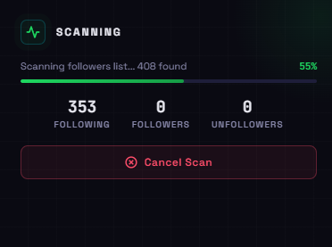
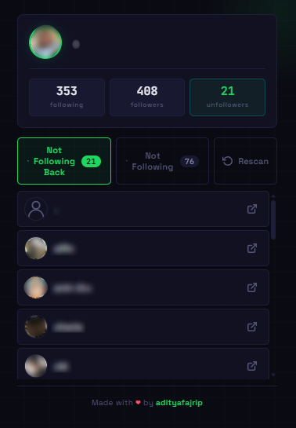
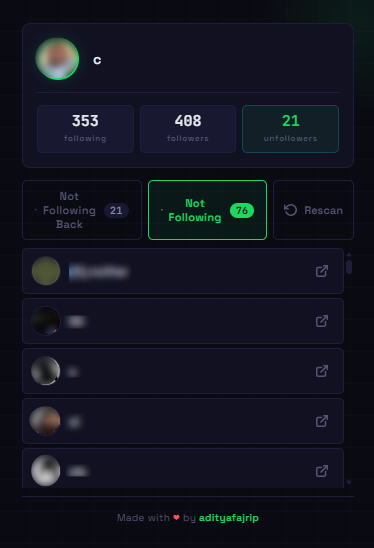

# Spotify Unfollowers

Chrome/Edge extension to check who doesn't follow you back on Spotify.

## Preview

| Scanning | Not Following Back | Not Following |
|----------|-------------------|---------------|
|  |  |  |

## Features

- Scan any public Spotify profile
- See who doesn't follow you back
- See who you haven't followed back

## Usage

1. Make sure you're logged in at [open.spotify.com](https://open.spotify.com)
2. Open a profile page (`open.spotify.com/user/...`)
3. Click the extension icon → **Start Scan**
4. Wait for results

## Installation

Load the `dist/` folder as an unpacked extension:

- **Chrome**: `chrome://extensions` → Developer mode → Load unpacked
- **Edge**: `edge://extensions` → Developer mode → Load unpacked

## Notes

- Scrapes public pages, no official Spotify API used
- May break if Spotify changes their page layout
- All data stays local in your browser

## License

MIT